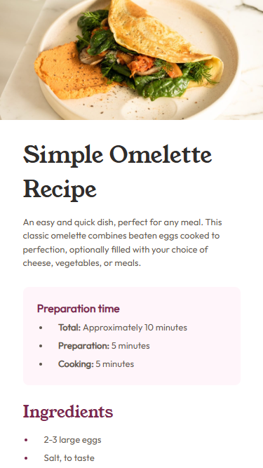
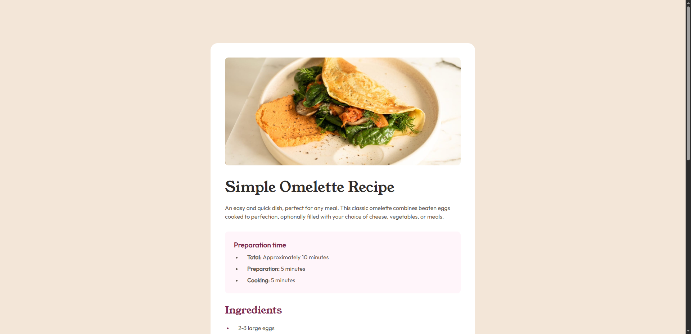

---
# Recipe Page

This is a solution to the Recipe page challenge.

## Table of contents

- [Overview](#overview)
  - [The Challenge](#the-challenge)
  - [Screenshot](#screenshot)
  - [Links](#links)
- [My Process](#my-process)
  - [Built with](#built-with)
  - [What I Learned](#what-i-learned)
  - [Continued Development](#continued-development)
- [Author](#author)
---

## Overview

This project is a responsive recipe page for a simple omelette. It's a great challenge for practicing web development skills, including semantic HTML, styling with CSS, and building a layout that adapts to different screen sizes.

### The Challenge

Users should be able to:

  - View the optimal layout for the component depending on their device's screen size.

### Screenshot

| Mobile View | Desktop View |
| :--- | :--- |
|  |  |

### Links

  - [Solution URL](https://github.com/Sadab-Wasi/Recipe-page/blob/main/index.html)
  - [Live Site URL](https://recipe-page-seven-mocha.vercel.app/)

-----

## My Process

I approached this project by first structuring the content with semantic HTML to provide a clear hierarchy. Then, I used a mobile-first approach with CSS, building the design for desktop screens before adding media queries to adapt the layout for smaller viewports.

### Built with

  - **Semantic HTML5 markup**
  - **CSS custom properties** for consistent styling
  - **Flexbox** for responsive layout
  - **Custom fonts** imported via `@font-face`
  - **Mobile-first workflow**
  - **`<table>`** for structured nutrition data

### What I Learned

This project was a great opportunity to reinforce my knowledge of:

  - **Semantic Markup:** Using elements like `<main>`, `<footer>`, `<h1>`, `<h2>`, `<ul>`, `<ol>`, and `<table>` to give content meaning and improve accessibility.
  - **Custom Fonts:** The `@font-face` rule was essential for loading the specific `Outfit` and `YoungSerif` fonts from local files, ensuring the design matched the provided mockups exactly.
  - **CSS Custom Properties:** I used `:root` variables to define the color palette, making it easy to manage and update the theme of the page.
  - **Responsive Design:** I implemented media queries to adjust the padding and layout for smaller screens, ensuring the page is fully responsive, including a specific adjustment for mobile devices to remove padding and image borders.

<!-- end list -->

```css
/* Example of using CSS custom properties for colors */
:root {
  --white: hsl(0, 0%, 100%);
  --rose_800: hsl(332, 51%, 32%);
  --stone_600: hsl(30, 10%, 34%);
  /* ... other color variables */
}

/* Example of a mobile-first media query */
@media (max-width: 576px) {
  html {
    font-size: 14px;
  }
  .content {
    padding: 0rem;
  }
  .food-image {
    padding: 0;
    border-radius: 0;
  }
}
```

### Continued Development

In the future, I would like to focus more on:

  - **Accessibility Auditing:** A deeper dive into accessibility tools to ensure all interactive elements and content are usable by everyone.
  - **CSS Transitions:** Adding subtle transitions to elements on hover or focus to create a more polished user experience.
  - **BEM Naming Convention:** Adopting a CSS naming convention like Block Element Modifier (BEM) to keep the stylesheet even more organized and scalable.

-----

## Author

  - GitHub - [@Sadab-Wasi](https://www.google.com/search?q=https://github.com/Sadab-Wasi)